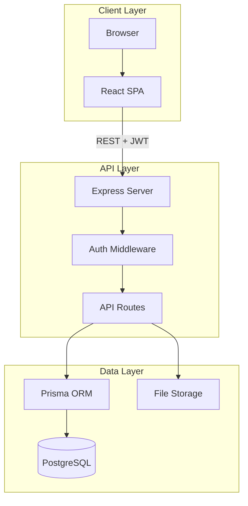

# MacTech QMS — Full Site Architecture

Complete technical architecture of the MacTech Quality Management System: frontend, backend, data model, and integrations.

---

## 1. High-Level Overview



---

## 2. Technology Stack

| Layer | Technology |
|-------|------------|
| **Frontend** | Vite 5, React 18, TypeScript, React Router 6, Tailwind CSS, TipTap (rich text), React Hook Form, Zod, Lucide React, Framer Motion, Zustand |
| **Backend** | Node.js, Express 4, ES modules |
| **Database** | PostgreSQL (via `DATABASE_URL`) |
| **ORM** | Prisma 6 (`server/prisma/schema.prisma`) |
| **Auth** | JWT Bearer token (`JWT_SECRET`); optional `X-INTEGRATION-KEY` for form-records, governance, training |
| **Storage** | Local filesystem (`UPLOAD_DIR`); FileAsset metadata in DB |
| **PDF** | Puppeteer + HTML generation (`server/src/pdf.js`) |

---

## 3. Directory Structure

```
QMS/
├── src/                          # Frontend (Vite + React)
│   ├── App.tsx                   # Routes, AuthProvider, AppProvider
│   ├── main.tsx
│   ├── components/
│   │   ├── layout/               # MainLayout, Sidebar, Header, ProtectedLayout
│   │   ├── ui/                   # Badge, Button, Card, Input, Modal, Table
│   │   ├── cmmc/                 # CMMC-specific (SignPanel, StatusPill, etc.)
│   │   └── modules/compliance/   # SignatureModal, GovernanceApprovalPanel, AuditTrailPanel
│   ├── context/                 # AuthContext, AppContext
│   ├── hooks/                    # useDocumentTypes, etc.
│   ├── lib/                     # api.ts, format.ts, sidebarConfig.tsx, schemas
│   ├── pages/                   # Page components
│   │   ├── capas/               # CAPAList, CAPANew, CAPADetail
│   │   ├── system/               # SystemDashboard, SystemUsers, SystemRoles, etc.
│   │   └── placeholders/         # Approvals, MyTasks, TeamTraining
│   ├── store/                   # useQmsStore (Zustand)
│   └── types/
├── server/                      # Backend
│   ├── prisma/
│   │   └── schema.prisma        # Full data model
│   ├── src/
│   │   ├── index.js             # Express app, route mount, static serve
│   │   ├── auth.js              # Login, authMiddleware, requirePermission, requireRoles
│   │   ├── audit.js             # createAuditLog, requestIdMiddleware
│   │   ├── db.js                # Prisma client
│   │   ├── documents.js         # Document CRUD, workflow, PDF
│   │   ├── pdf.js               # Document + FormRecord PDF generation
│   │   ├── formRecords.js       # FormRecord API
│   │   ├── capas.js             # CAPA API
│   │   ├── changeControls.js    # Change Control API
│   │   ├── training.js          # Training API
│   │   ├── periodicReviews.js   # Periodic reviews
│   │   ├── dashboard.js         # Dashboard metrics
│   │   ├── notifications.js     # Notifications
│   │   ├── tasks.js             # Unified My Tasks
│   │   ├── users.js             # User list for pickers
│   │   ├── files.js             # File stream/delete
│   │   ├── governanceRoutes.js  # Governance API
│   │   ├── cmmc.js              # CMMC documents
│   │   ├── rbac/                # permissionCatalog, roleCatalog
│   │   └── system/              # audit, users, roles, security, reference, retention, esign
│   └── scripts/                # Migrations, seed, ingest
├── docs/                        # Architecture, policies, procedures
├── dist/                        # Built frontend (Vite output)
└── package.json, vite.config.ts, tailwind.config.js
```

---

## 4. Frontend Architecture

### 4.1 Routing (App.tsx)

| Path | Component | Purpose |
|------|-----------|---------|
| `/login` | LoginScreen | Login form; redirect if authenticated |
| `/` | ExecutiveDashboard | Main dashboard |
| `/dashboard` | QualityHealthDashboard | Quality metrics |
| `/search` | SearchPage | Cross-entity search |
| `/documents` | DocumentControl | Document list, create |
| `/documents/:id` | DocumentDetail | Document view, workflow, PDF |
| `/training` | TrainingCompetency | Training modules |
| `/periodic-reviews` | PeriodicReviewsPage | Periodic review queue |
| `/audits` | AuditManagement | Audit list |
| `/capas` | CAPAList | CAPA list |
| `/capas/new` | CAPANew | Create CAPA |
| `/capas/:id` | CAPADetail | CAPA detail |
| `/change-control` | ChangeControl | Change control list |
| `/change-control/new` | ChangeControlNew | Create change |
| `/change-control/:id` | ChangeControlDetail | Change detail |
| `/risk` | RiskManagement | Risk management |
| `/equipment` | EquipmentAssets | Equipment/assets |
| `/suppliers` | SupplierQuality | Supplier quality |
| `/system` | SystemManagementLayout | System admin shell |
| `/system/users` | SystemUsers | User management |
| `/system/roles` | SystemRoles | Role management |
| `/system/audit` | SystemAudit | Audit log viewer |
| `/system/security-policies` | SystemSecurityPolicies | Security config |
| `/system/reference` | SystemReference | Departments, sites |
| `/system/retention` | SystemRetention | Retention policies |
| `/system/esign` | SystemESign | E-sign config |
| `/completed-forms` | CompletedForms | Form record list |
| `/completed-forms/:id` | CompletedFormDetail | Form record detail |
| `/approvals` | Approvals | Approval queue (placeholder) |
| `/my-tasks` | MyTasks | My Tasks (placeholder) |
| `/my-training` | MyTraining | My training (placeholder) |

### 4.2 Layout Hierarchy

```
AuthProvider
  AppProvider
    BrowserRouter
      Routes
        /login → LoginScreen
        / → ProtectedLayout (redirect to /login if not authenticated)
          MainLayout (Sidebar + Header + outlet)
            [Page components]
```

### 4.3 Role-Based Navigation (sidebarConfig.tsx)

| Role | Key Nav Items |
|------|---------------|
| System Admin | Dashboard, Documents, Search, Change Control, CAPA, System, Completed Forms |
| Quality Manager | Dashboard, System, Quality Health, Documents, Search, Training, Periodic Reviews, Change Control, CAPA, Audits, Suppliers, Risk, Equipment, Completed Forms |
| Manager | Dashboard, Training, Periodic Reviews, Documents, Team Training, Approvals, Completed Forms |
| User | My Tasks, My Training, Documents, Search |

### 4.4 Auth Flow

- **Login:** POST `/api/auth/login` → `{ token, user }`; stored in localStorage (`qms_auth`)
- **Protected routes:** `ProtectedLayout` checks `isAuthenticated`; redirects to `/login` if not
- **API calls:** `Authorization: Bearer <token>` via `apiRequest()` in `lib/api.ts`
- **User refresh:** `GET /api/auth/me` (optional; token contains user claims)

---

## 5. Backend API Architecture

### 5.1 Route Mount (server/src/index.js)

| Mount | Auth | Purpose |
|-------|------|---------|
| `/api/auth` | — | Login, JWT issue |
| `/api/auth/me` | JWT | Current user |
| `/api/documents` | JWT | Document CRUD, workflow, PDF |
| `/api/notifications` | JWT | Notifications |
| `/api/tasks` | JWT | Unified My Tasks |
| `/api/users` | JWT | User list (ACTIVE only, for pickers) |
| `/api/training` | JWT or X-INTEGRATION-KEY | Training modules, assignments, completions |
| `/api/periodic-reviews` | JWT | Periodic reviews |
| `/api/dashboard` | JWT | Dashboard metrics |
| `/api/capas` | JWT | CAPA CRUD, workflow |
| `/api/change-controls` | JWT | Change control CRUD, workflow |
| `/api/files` | JWT | File stream/delete |
| `/api/form-records` | JWT or X-INTEGRATION-KEY | Form records |
| `/api/governance` | JWT or X-INTEGRATION-KEY | Governance API |
| `/api/system` | JWT + RBAC | System admin (users, roles, audit, etc.) |
| `/api/cmmc` | JWT | CMMC documents |

### 5.2 Document Workflow (Controlled Documents)

```
DRAFT
  → submit-review (reviewerIds, approverId)
  → IN_REVIEW

IN_REVIEW
  → review (APPROVED_WITH_COMMENTS | REQUIRES_REVISION)
  → AWAITING_APPROVAL (when all reviews done)
  → DRAFT (if REQUIRES_REVISION)

AWAITING_APPROVAL
  → approve (password, e-sign)
  → APPROVED

APPROVED
  → quality-release (password, e-sign)
  → EFFECTIVE

EFFECTIVE
  → revise (major/minor)
  → new DRAFT
```

### 5.3 Key API Groups

- **Documents:** CRUD, submit-review, review, approve, quality-release, revise, PDF, links, comments
- **Form Records:** List, create, update, finalize, PDF (JWT or integration key)
- **CAPA:** CRUD, status transitions, tasks, approve-plan, close, files, links
- **Change Control:** CRUD, status transitions, tasks, approve, close, files, links
- **Training:** Modules, my-assignments, complete (JWT or integration key)
- **System:** Users, roles, audit log, security policies, reference data, retention, e-sign config

---

## 6. Database Model (Prisma)

### 6.1 Core Domains

| Domain | Key Models |
|--------|------------|
| **Documents** | Document, DocumentHistory, DocumentRevision, DocumentSignature, DocumentAssignment, DocumentLink, DocumentComment |
| **Form Records** | FormRecord, FormRecordCounter |
| **CAPA** | CAPA, CapaTask, CapaHistory, CapaSignature |
| **Change Control** | ChangeControl, ChangeControlTask, ChangeControlHistory, ChangeControlSignature |
| **Training** | TrainingModule, UserTrainingRecord |
| **Files** | FileAsset, FileLink |
| **Users & RBAC** | User, Role, Permission, RolePermission |
| **Audit** | AuditLog |
| **System** | SecurityPolicy, RetentionPolicy, ESignConfig, Department, Site, JobTitle |
| **CMMC** | CmmcDocument, CmmcRevision, CmmcSignature |

### 6.2 Document Status Flow

- **DRAFT** → IN_REVIEW → AWAITING_APPROVAL → APPROVED → EFFECTIVE
- **OBSOLETE**, **ARCHIVED** for retired versions

### 6.3 Assignment Types (Document)

- **REVIEW** — Reviewers complete review
- **APPROVAL** — Approver signs
- **QUALITY_RELEASE** — Quality Manager releases

---

## 7. Integration & Auth Variants

| Endpoint Group | JWT | X-INTEGRATION-KEY |
|----------------|-----|-------------------|
| Most APIs | Required | — |
| Form records | Supported | Supported (read/write) |
| Governance | Supported | Supported |
| Training (GET only) | Supported | Supported (read-only) |

---

## 8. Key Frontend Components

| Component | Purpose |
|-----------|---------|
| **MainLayout** | Sidebar + Header + page outlet |
| **Sidebar** | Role-based nav; collapsible |
| **Header** | Search, user, notifications, document actions |
| **PageShell** | Page wrapper with title, actions |
| **DocumentContentRender** | Safe HTML render; strips signature blocks |
| **RichTextEditor** | TipTap-based editor for document content |
| **SignatureModal** | 21 CFR Part 11-style e-sign (password, reason) |
| **GovernanceApprovalPanel** | Governance artifact verification |

---

## 9. Deployment

- **Frontend:** Vite build → `dist/`; copied to `server/dist/` for Railway
- **Backend:** Express serves `server/dist` for SPA; `/api/*` for API
- **Database:** PostgreSQL via `DATABASE_URL`; Prisma `db push`
- **Env:** `JWT_SECRET`, `DATABASE_URL`, `INTEGRATION_KEY` (optional), `UPLOAD_DIR`

---

## 10. File Inventory (Key Paths)

| Area | Files |
|------|-------|
| **Routes** | src/App.tsx |
| **Auth** | src/context/AuthContext.tsx, server/src/auth.js |
| **Documents** | src/pages/DocumentDetail.tsx, DocumentControl.tsx, server/src/documents.js, server/src/pdf.js |
| **CAPA** | src/pages/capas/, server/src/capas.js |
| **Change Control** | src/pages/ChangeControl*.tsx, server/src/changeControls.js |
| **Form Records** | src/pages/CompletedForms.tsx, CompletedFormDetail.tsx, server/src/formRecords.js |
| **System** | src/pages/system/, server/src/system/ |
| **RBAC** | server/src/rbac/permissionCatalog.js, roleCatalog.js |
| **Schema** | server/prisma/schema.prisma |
